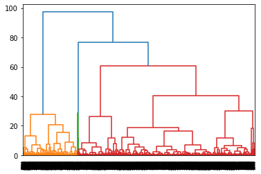

<link rel="stylesheet" href="styles.css" type="text/css">
<link rel="stylesheet" href="site_libs/academicons-1.9.1/css/academicons.min.css"/>

   

## **Predicting Hotel reservation cancellation**

 

🚨**This was a project based on real data from a hotel in Portugal.**

   

### 1. Figure

[Fig. Clustering features]

[Fig. Hierarchical Clustering ]

 

  

### 2. Goal
To cluster the customers into 3-4 groups 

 

### 3. Methodology & Summary

  + Unsupervised learning model was conducted: Cohort Analysis, RFM analysis, Kmeans, Hierarchy model 
  + Could seperated into 3-4 groups 

 

### 4. Code

Please click [HERE](https://nbviewer.org/github/ykyang0/Data-Science/blob/main/Multivariate_.ipynb) for the analysis report and code.

 

