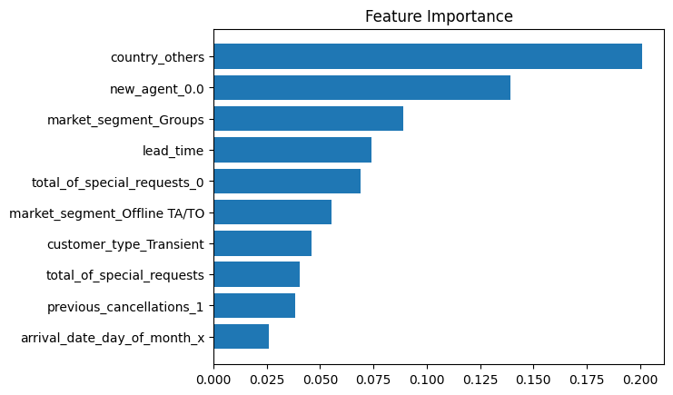

<link rel="stylesheet" href="styles.css" type="text/css">
<link rel="stylesheet" href="site_libs/academicons-1.9.1/css/academicons.min.css"/>

   

## **Classification Project - Predicting Hotel reservation cancellation**

 

🚨**This was a project based on real data from a hotel in Portugal.**

 

### 1. Introduction
\       Life is rife with uncertainty, and reserving a hotel stay for a travel or business trip is no exception. Given the unpredictable nature of circumstances, customers may need to cancel or reschedule their visit, causing potential stress for both customers and the hotel. To address this challenge, a contingency plan becomes necessary. This project aims to provide assistance and ideas for developing backup plans specifically tailored for hotels.\

\    Efficiently managing cancellations and rescheduling is crucial from a hotel's business perspective. By employing machine learning methods, it becomes possible to analyze customer cancellation patterns and utilize this information to create a robust plan. This project focuses on predicting the probability of reservation cancellations, allowing for proactive adjustments. By utilizing this information, improvements can be made to the booking system to optimize hotel occupancy. This model serves as an initial step toward maximizing the hotel’s revenue by effectively managing cancellations and optimizing room occupancy.\

 

### 2. Goal
 + The objective was to construct a prediction model for hotel cancellations using customers' reservation features.

 

### 3. Methodology
  
 + Commonly used classification algorithms, such as Logistic Regression, Ensemble Learning, Bagging Classifier, Random Forest, Decision Tree, Neural Network and XGBoost were employed.
 + After performing cross-validation and hyperparameter tuning, XGBoost regression yielded the best results.

 

### 4. Insights

 + There was 37.1% cancellations in  119,390 of reservations. The model was able to predict 91% of these cancellations. 
 + The following factors were commonly found to be significant in determining the likelihood of a reservation being canceled by multiple algorithms:
      + The guest's nationality (Portuguese guests tended to cancel more frequently, possibly due to being local customers).
      + Lead time between booking and check-in (longer lead times were associated with higher cancellation rates).
      + Total number of special requests made by the customers (higher number of special requests was associated with lower cancellation rates).
      + The presence of previous non-canceled reservations (customers with such reservations had a lower tendency to cancel).
  
 

### 5. Figures
 + The first figure showcases the crucial factors that exert a substantial influence on cancellations, as determined by the XGBoost model, which has demonstrated exceptional performance. Each factor's importance has been normalized to ensure that the total importance amounts to 1.
 + The second figure is a ROC graph that shows the performance of a model. I have compared the versions of the models that I have built.

[Fig. XGB Classification features by importance]

 

  

### 6. Code

Please click [HERE](https://colab.research.google.com/drive/12Al9qU7wCRgvVZj5hZZ6AK8DbR-8LtIf?usp=sharing)(Colab) for the analysis report and code.

 

