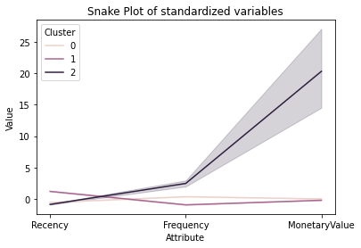
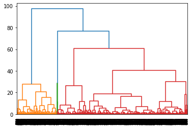

<link rel="stylesheet" href="styles.css" type="text/css">
<link rel="stylesheet" href="site_libs/academicons-1.9.1/css/academicons.min.css"/>

   

## **Clustering Project - Customer Segmentation**

 

🚨**The dataset of this project is from UK based non-store online retail.**
 

  

### 1. Goal
 + To cluster the customers into 3-4 groups 

 

### 2. Methodology

 + Unsupervised learning model was conducted: Cohort Analysis, RFM analysis, Kmeans, Hierarchy model 
 + Could seperated into 3-4 groups 
 
 

### 3. Insight

 + Unsupervised learning model was conducted: Cohort Analysis, RFM analysis, Kmeans, Hierarchy model 
 + Could seperated into 3-4 groups 

 

### 4. Summary

 + Unsupervised learning model was conducted: Cohort Analysis, RFM analysis, Kmeans, Hierarchy model 
 + Could seperated into 3-4 groups 

 

### 5. Figure

[Fig. Clustering features]

[Fig. Hierarchical Clustering ]
 

### 6. Code

Please click [HERE](https://colab.research.google.com/drive/1oXGLWlos00W9cysmIfVfhFO72cbf7YsA?usp=sharing) for the analysis report and code.

