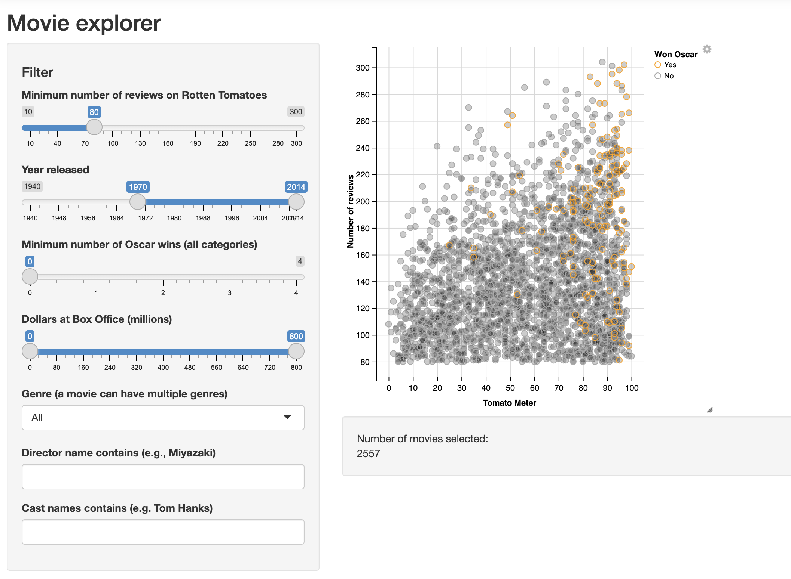

<link rel="stylesheet" href="styles.css" type="text/css">
<link rel="stylesheet" href="site_libs/academicons-1.9.1/css/academicons.min.css"/>

   

## **ML project3**

 

🚨**THIS IS A FICTIONAL PROJECT MEANT AS AN EXAMPLE FOR THE STEPBYSTAT COMMUNITY.**

   

### 1. Screenshot of Dashboard

   

### 2. Summary

+ blah blah blah

   

### 3. Live Demo

For more insights, please check my Colab notebook [HERE](https://colab.research.google.com/drive/1ZkEIYk-SbEn-D862W84QoMAdlJ2FRCBH?usp=sharing).

