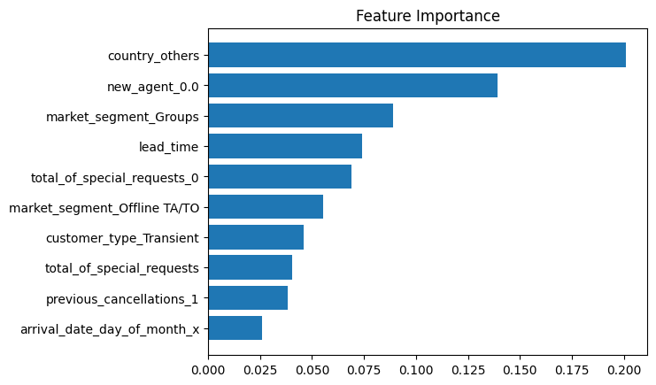

<link rel="stylesheet" href="styles.css" type="text/css">
<link rel="stylesheet" href="site_libs/academicons-1.9.1/css/academicons.min.css"/>

   

## **Regression Project - A model predicting rideshare prices**

 

🚨**This project involved analyzing Uber and Lyft ride data along with supplementary climate data.**

   

### 1. Goal
  + To build a prediction model of the rideshare prices with the features of rides. 

 

### 2. Methodology

  + To obtain a preliminary assessment of the models' performance, AutoML was initially executed on a subset of the data comprising 10% due to computational constraints.
  
  + The complete dataset was used to fit the following machine learning models: Linear Regression, Lasso, Ridge, LightGBM, Gradient Boosting, XGBoost, Random Forest, and Neural Network. Of these, XGBoost regression yielded the best performance.

 

### 3. Insights

  + The analysis revealed that distance, surge_multiplier, and ride type were significant features that influenced the price.
  
  + Although climate data was included in the dataset, the analysis revealed that it had minimal impact.

 

### 4. Summary

  + 
  
  + 

  
 

### 5. Figure

[Fig. XGB Classification features by importance]

 

  

### 6. Code
For more insights, please check my Colab notebook [HERE](https://colab.research.google.com/drive/1ZkEIYk-SbEn-D862W84QoMAdlJ2FRCBH?usp=sharing).

