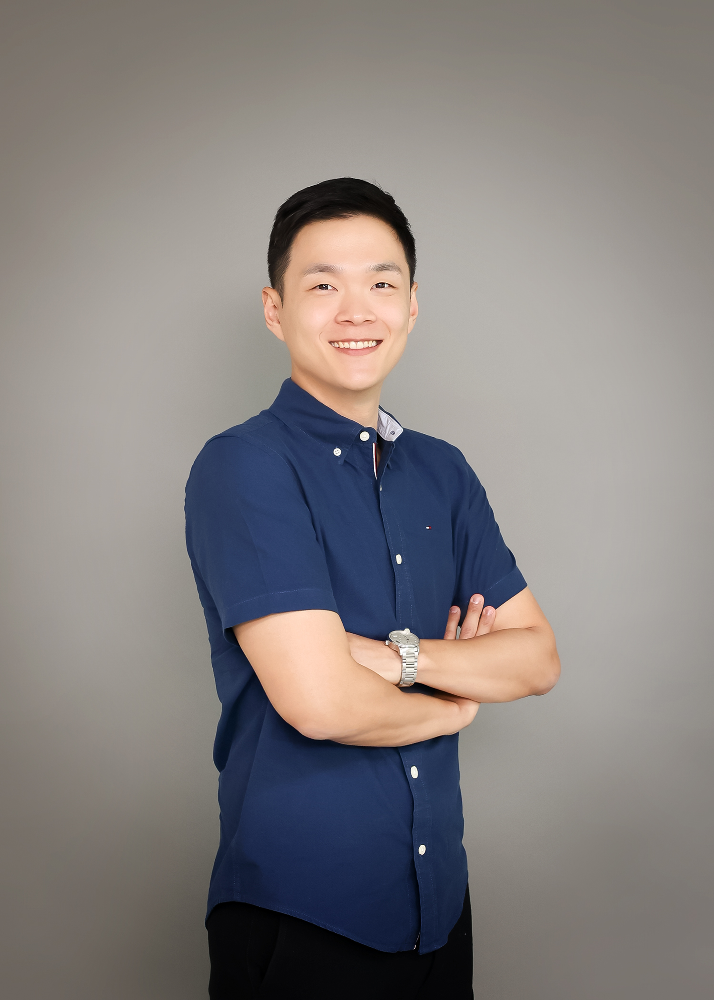

<!-- Google tag (gtag.js) -->

<link rel="stylesheet" href="styles.css" type="text/css">
<link rel="stylesheet" href="site_libs/academicons-1.9.1/css/academicons.min.css"/>

 

 
👋🏽 Hello, my name is Young Keun Yang.

🎓 Soon to graduate with an M.A. in Statistics at the University of South Florida. (August 2023)

🌇 Resides in Tampa Bay Area, passionate about developing and applying statistical and machine learning models that bring insights or prediction.

📚 I used to work in Korea's sports industry and was passionate about using data. I decided to start a new career; to do so, I studied Statistics at a graduate level. Over time, I realized data science is the best area in that I can show my statistical knowledge and apply it to a meaningful application. I have tried to get used to coding, which helps to elaborate my understanding, and I have become confident that I am ready to be a data scientist.

🏔In my free time, I play golf or baseball or spend time with my family.

💪 Specialties in Mathematical, Statistical thinking which will be essential to understanding complicated processes or models.

+ Programming: Python, R
+ Data visualization: Tableau
+ Database: mySQL, Postgre SQL